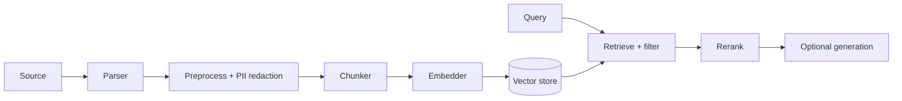

# Architecture

The engine is built **contract-first**: every replaceable component is defined
by an interface in `Sellinnate\RagEngine\Contracts`, and consumers depend on the
contracts, never on the concrete implementations.

## Contracts

| Contract | Responsibility |
|---|---|
| `Parser` | Extract normalized text + structure from a raw source |
| `Chunker` | Split a parsed document into indexable chunks |
| `Tokenizer` | Count / truncate tokens for budgeting and cost |
| `Embedder` | Turn text into dense vectors |
| `VectorStore` | Store and search vectors with metadata filters |
| `Reranker` | Re-order retrieved hits by relevance |
| `QueryTransformer` | Expand / rewrite a query before retrieval |
| `Llm` | Optional generation backend |
| `KeyManagement` | KMS abstraction for BYOK envelope encryption |

## Driver managers

Each subsystem is fronted by a **driver manager** that resolves a named
configuration block to a concrete driver, caches it, and lets you register your
own drivers at runtime:

```php
app(\Sellinnate\RagEngine\Managers\EmbedderManager::class)
    ->extend('my-provider', fn (array $config) => new MyEmbedder($config));
```

The manager dispatches on the `driver` key of the config block, so naming a
connection is independent of which driver powers it.

## Pipeline shape



Ingestion (left half) is asynchronous and idempotent; retrieval (right half) is
synchronous and low-latency. The generation step is fully optional and isolated:
search-only consumers carry no LLM dependency.

## The facade

`Rag` is the public entrypoint (`Sellinnate\RagEngine\Facades\Rag`). It exposes
the resolved drivers and cross-cutting services:

```php
Rag::embedder();     // current Embedder
Rag::vectorStore();  // current VectorStore
Rag::kms();          // current KeyManagement
Rag::encrypter();    // EnvelopeEncrypter
Rag::tenant();       // TenantContext
Rag::forTenant('t1', fn () => /* scoped work */);
```
