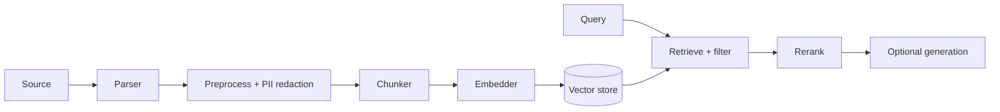

# Architecture

This page is the map. Once you understand these four ideas — **contracts**,
**driver managers**, the **pipeline**, and the **facade** — every other page is
just detail.

::: callout info "In plain words"
The engine is built like a set of power sockets. Each socket (embedding, vector
storage, LLM…) has a standard shape (a *contract*). You can plug in any
compatible device (a *driver* — OpenAI, Ollama, Qdrant…) without rewiring the
house (your code). Swapping a provider is changing what's plugged in, not
rebuilding the wall.
:::

## 1. Contracts (interfaces)

A **contract** is a PHP interface that defines *what* a component must do, not
*how*. Your application — and the engine's own internals — depend on the
contract, never on a specific implementation. That's what makes providers
swappable.

| Contract | Responsibility |
|---|---|
| `Parser` | Extract clean text + structure from a raw source (PDF, HTML, CSV…). |
| `Chunker` | Split a parsed document into small, indexable chunks. |
| `Tokenizer` | Count / truncate tokens for budgeting and cost. |
| `Embedder` | Turn text into vectors (lists of numbers capturing meaning). |
| `VectorStore` | Store vectors and find the nearest ones to a query. |
| `Reranker` | Re-order retrieved results by relevance, more accurately. |
| `QueryTransformer` | Expand or rewrite a query before searching. |
| `Llm` | Optional: write a natural-language answer. |
| `KeyManagement` | The KMS abstraction for encryption keys (BYOK). |

The full method signatures are in the **[Contracts reference](/reference/contracts)**.

::: callout tip "Why this matters to you"
Because everything is behind a contract, you can start on the free in-memory
drivers, then move to Qdrant + OpenAI in production by editing `.env` — your
controllers, jobs and tests don't change a line.
:::

## 2. Driver managers

Each subsystem is fronted by a **driver manager** — the same pattern as Laravel's
own `DB`, `Cache` and `Filesystem` managers. A manager:

- reads a named connection from config,
- looks at its `driver` key,
- builds (and caches) the matching implementation,
- and lets you **register your own** drivers at runtime.

```php
use Sellinnate\RagEngine\Managers\EmbedderManager;

// Add a brand-new embedding provider without forking the package:
app(EmbedderManager::class)->extend(
    'my-provider',
    fn (array $config) => new MyEmbedder($config),
);
```

Because the manager dispatches on the config's `driver` key, the *name* of a
connection is independent of *which driver* powers it. See
**[Custom drivers](/guides/custom-drivers)** for the full recipe.

## 3. The pipeline

Work splits into two halves with very different performance needs:



- **Indexing (left)** — *parse → clean & redact → chunk → embed → store.* Slow
  (it calls embedding models), so it runs **asynchronously on a queue** and is
  **idempotent** (safe to retry). Covered in
  **[Orchestration & jobs](/concepts/orchestration)**.
- **Retrieval (right)** — *embed query → find nearest → filter → rerank.* Fast
  and **synchronous**, so it runs inside a normal web request. Covered in
  **[Retrieval & search](/concepts/retrieval)**.
- **Generation** — fully **optional and isolated**. A search-only app carries no
  LLM dependency at all.

## 4. The `Rag` facade

`Rag` (`Sellinnate\RagEngine\Facades\Rag`) is your single entry point. It exposes
the high-level flows and the resolved drivers:

```php
use Sellinnate\RagEngine\Facades\Rag;

// High-level flows
Rag::ingest($source);          // register a Document
Rag::process($document);       // run the indexing pipeline
Rag::search('question');       // retrieve chunks
Rag::ask('question');          // retrieve + generate (optional LLM)

// Direct access to the current drivers / services
Rag::embedder();               // current Embedder
Rag::vectorStore();            // current VectorStore
Rag::kms();                    // current KeyManagement
Rag::models();                 // Eloquent model embedding service
Rag::tenant();                 // the TenantContext
Rag::forTenant('t1', fn () => /* work scoped to tenant t1 */);
```

::: callout info "Prefer the facade"
Stick to `Rag::` in application code. The managers and concrete classes are
there when you need them (e.g. registering a custom driver), but day-to-day you
won't touch them.
:::

## How a single request flows

1. A user submits a question to your controller.
2. You call `Rag::search($question)` (or `Rag::ask(...)`).
3. The engine embeds the question with the **current embedder**.
4. It asks the **current vector store** for the nearest chunks **scoped to the
   current tenant** (always — see [Multi-tenancy](/concepts/multi-tenancy)).
5. Optional reranking/MMR/threshold refine the list.
6. You get back `SearchHit` objects with content, score and provenance — or, with
   `ask()`, a written answer plus citations.

## Best practices

- **Depend on the facade and contracts, not concrete drivers** — keeps your code
  portable across providers.
- **Do indexing on a queue, searching inline** — match each half to its latency
  profile.
- **Register custom drivers in a service provider's `boot()`** so they're
  available everywhere.

## Next

- **[Ingesting content](/guides/ingestion)** — the start of the pipeline.
- **[Retrieval & search](/concepts/retrieval)** — the end users feel.
