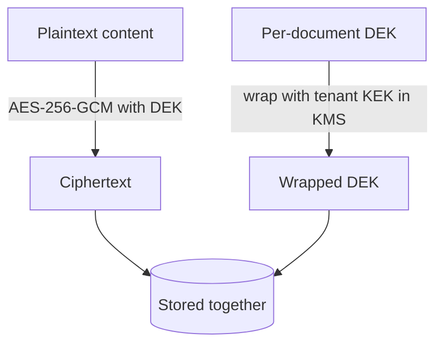

# Security & BYOK

Encryption and key management are first-class, not bolted on. The model is
**Bring-Your-Own-Key (BYOK) envelope encryption** with **crypto-shredding**.

## Envelope encryption

Each piece of sensitive content (source body, chunk text, sensitive metadata) is
encrypted with a fresh **Data Encryption Key (DEK)**. The DEK itself is never
stored in plaintext — it is *wrapped* (encrypted) by the tenant's **Key
Encryption Key (KEK)**, which lives inside a KMS.



```php
use Sellinnate\RagEngine\Facades\Rag;

$payload = Rag::encrypter()->encrypt('confidential', 'tenant-42');
// $payload = ciphertext + wrappedDek + keyId   (no plaintext key anywhere)

$plain = Rag::encrypter()->decrypt($payload);
```

The plaintext DEK exists only in memory for the duration of an operation, then
is discarded. Only the wrapped DEK is persisted.

## KMS abstraction

The `KeyManagement` contract abstracts the KMS. The package ships a **local**
driver for dev/test (deterministic, zero-network), and the contract is designed
for AWS KMS, GCP KMS, Azure Key Vault and HashiCorp Vault drivers.

```php
$kms = Rag::kms();
$kms->createKey('tenant-42');
$dataKey = $kms->generateDataKey('tenant-42'); // {plaintext, wrapped}
$kms->rotateKey('tenant-42');                  // non-destructive
```

## Crypto-shredding (right to erasure)

Deleting a tenant or document does not require scrubbing every derived copy.
Instead you **destroy the key** — and every value encrypted under it becomes
permanently unrecoverable, including in backups.

```php
Rag::kms()->destroyKey('tenant-42');
// All content wrapped under tenant-42's KEK can no longer be decrypted.
```

::: callout warning "The honest boundary on vectors"
Embedding vectors are **not** BYOK-encrypted: approximate-nearest-neighbour
search needs the floats in the clear. They are protected by encryption-at-rest
with a KMS-backed key and can be co-located inside the tenant's perimeter where
absolute isolation is required.
:::

## Key rotation

A KEK can be rotated without re-ingesting data. The local KMS keeps every KEK
version: new DEKs are wrapped with the newest version, while previously wrapped
DEKs continue to unwrap — so rotation is non-destructive.

## What is verified by tests

The package's test suite asserts these as invariants:

- AES-256-GCM detects tampering and rejects wrong keys.
- A destroyed key makes previously encrypted data unrecoverable.
- Rotation keeps old data readable **and** uses the newest key for new data.
- Tenant keys are isolated: a DEK wrapped under tenant A cannot be unwrapped under tenant B.
