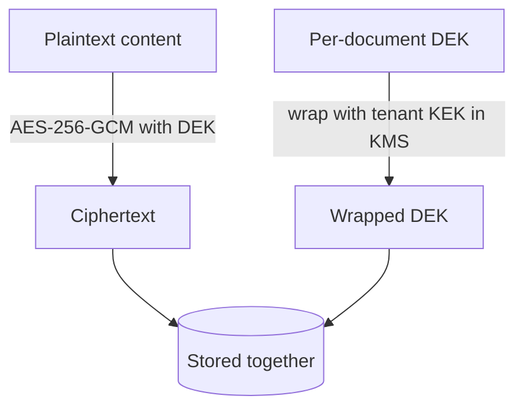

# Security & BYOK

Encryption and key management are first-class, not bolted on. The model is
**Bring-Your-Own-Key (BYOK) envelope encryption** with **crypto-shredding**.

::: callout info "In plain words"
Your ingested content is encrypted at rest, and *you* control the keys (that's
BYOK). To honour a "delete all my data" request, you don't have to hunt down
every copy and backup — you destroy the key, and the data becomes permanently
unreadable everywhere at once (that's *crypto-shredding*). The two terms below,
**DEK** and **KEK**, are just "the key that locks the data" and "the key that
locks the keys".
:::

## Envelope encryption

Each piece of sensitive content (source body, chunk text, sensitive metadata) is
encrypted with a fresh **Data Encryption Key (DEK)**. The DEK itself is never
stored in plaintext — it is *wrapped* (encrypted) by the tenant's **Key
Encryption Key (KEK)**, which lives inside a KMS.



```php
use Sellinnate\RagEngine\Facades\Rag;

$payload = Rag::encrypter()->encrypt('confidential', 'tenant-42');
// $payload = ciphertext + wrappedDek + keyId   (no plaintext key anywhere)

$plain = Rag::encrypter()->decrypt($payload);
```

The plaintext DEK exists only in memory for the duration of an operation, then
is discarded. Only the wrapped DEK is persisted.

## KMS abstraction

The `KeyManagement` contract abstracts the KMS. The package ships a **local**
driver for dev/test (deterministic, zero-network), and the contract is designed
for AWS KMS, GCP KMS, Azure Key Vault and HashiCorp Vault drivers.

```php
$kms = Rag::kms();
$kms->createKey('tenant-42');
$dataKey = $kms->generateDataKey('tenant-42'); // {plaintext, wrapped}
$kms->rotateKey('tenant-42');                  // non-destructive
```

## Crypto-shredding (right to erasure)

Deleting a tenant or document does not require scrubbing every derived copy.
Instead you **destroy the key** — and every value *encrypted* under it (source
content, chunk text in the DB) becomes permanently unrecoverable, including in
DB backups. Plaintext vectors are additionally **deleted from the live vector
store** (across every namespace the tenant used); see the boundary note below.

```php
Rag::kms()->destroyKey('tenant-42');
// All content wrapped under tenant-42's KEK can no longer be decrypted.
```

::: callout warning "The honest boundary on vectors"
Embedding vectors — and the chunk text stored alongside them in the vector-store
payload — are **not** BYOK-encrypted: approximate-nearest-neighbour search needs
the floats (and lexical text for hybrid search) in the clear. They live inside
the **tenant perimeter**, and their at-rest protection depends on the vector
store's own encryption (e.g. Qdrant/disk encryption). Crypto-shredding a tenant
explicitly **deletes** these vectors from the live store; pre-existing store
backups are outside the key-destruction guarantee and must be handled by your
backup retention policy.
:::

## Key rotation

A KEK can be rotated without re-ingesting data. The local KMS keeps every KEK
version: new DEKs are wrapped with the newest version, while previously wrapped
DEKs continue to unwrap — so rotation is non-destructive.

## Best practices

- **Keep encryption enabled** (`RAG_ENCRYPTION_ENABLED=true`) for any sensitive
  corpus — it's the basis of crypto-shredding.
- **Use a real KMS in production.** The `local` driver is for dev/test; wire a
  cloud KMS (AWS/GCP/Azure/Vault) via the `KeyManagement` contract for production
  key custody.
- **Erase via the key, not by hand.** To honour erasure, `destroyKey()` /
  `rag:purge` the tenant — don't try to scrub individual rows.
- **Encrypt your vector store at rest too.** Vectors and their chunk text are
  *not* BYOK-encrypted (see the boundary note above); rely on the store's own
  disk/volume encryption.
- **Define a backup-retention policy.** Crypto-shredding covers live data and the
  live vector store; pre-existing *backups* are governed by your retention policy.
- **Rotate keys periodically** with `rag:rotate-keys` — it's non-destructive.

## What is verified by tests

The package's test suite asserts these as invariants:

- AES-256-GCM detects tampering and rejects wrong keys.
- A destroyed key makes previously encrypted data unrecoverable.
- Rotation keeps old data readable **and** uses the newest key for new data.
- Tenant keys are isolated: a DEK wrapped under tenant A cannot be unwrapped under tenant B.
