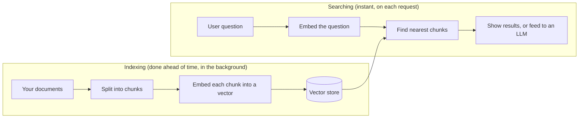

# What is RAG? (start here)

If you've never built a search or AI feature before, **read this page first**. It
explains the idea behind the package, the mental model you'll reuse everywhere
else, and defines every piece of jargon in one place. Nothing here assumes prior
knowledge of AI, vectors or search engines.

## The problem RAG solves

Large Language Models (LLMs) like GPT or Claude are great at writing answers, but
they only know what they were trained on. They don't know:

- *your* company handbook, *your* product catalogue, *your* support tickets;
- anything that changed after their training cut-off;
- anything private to your application.

If you just ask an LLM "What is our refund policy?", it will **guess** — and
often invent a confident but wrong answer (a "hallucination").

**Retrieval-Augmented Generation (RAG)** fixes this with a simple idea:

> Before asking the LLM to answer, first **retrieve** the most relevant pieces of
> *your* content, then hand them to the LLM and say "answer using only this".

So RAG = **Retrieval** (find the relevant text) **+ Augmented Generation** (let an
LLM write the answer using that text). The retrieval half is the hard, valuable
part — and it's what this package does for you. Generation is optional.

::: callout info "In plain words"
This package is a librarian. You give it documents; it reads, splits and files
them so that later, when someone asks a question, it can instantly pull out the
handful of paragraphs that actually answer it. Whether you then feed those
paragraphs to an LLM (to write a polished answer) or just show them to the user
(like a smart search box) is up to you.
:::

## How retrieval actually works

Computers can't compare meaning the way humans do. RAG works around this by
turning text into **numbers that capture meaning**, then comparing the numbers.

1. **Chunking** — A long document is split into small passages ("chunks"), e.g. a
   few paragraphs each. You search and retrieve *chunks*, not whole documents,
   because a 50-page PDF is too coarse to be a useful answer.
2. **Embedding** — Each chunk is sent to an *embedding model*, which returns a
   list of numbers (a **vector**) — say 1536 of them. The key property:
   passages with **similar meaning** get **similar vectors**, even if they use
   different words. "How do I get my money back?" and "refund process" land close
   together.
3. **Storing** — Those vectors go into a **vector store** (a database built to
   find "nearby" vectors quickly).
4. **Querying** — At search time, the user's question is embedded into a vector
   too. The vector store returns the chunks whose vectors are **closest** to the
   question's vector — i.e. the most semantically relevant passages.
5. **(Optional) Generating** — Those chunks are pasted into a prompt and an LLM
   writes the final answer, citing them.



The left half ("indexing") is slow and runs in the background. The right half
("searching") is fast and runs on each user request. This package keeps the two
strictly separated — so a plain search feature never needs an LLM at all.

## A 60-second mental model of the package

You'll work almost entirely through one entry point, the `Rag` facade:

```php
use Sellinnate\RagEngine\Facades\Rag;

// 1. INGEST: register a piece of content as a "Document".
$document = Rag::ingest(Rag::source()->text('Refunds are issued within 14 days.'));

// 2. PROCESS: run the background pipeline (parse → clean → chunk → embed → store).
Rag::process($document);

// 3. SEARCH: find relevant chunks for a question.
$hits = Rag::search('how long do refunds take?')->get();

// 4. (OPTIONAL) ASK: let an LLM write an answer from those chunks.
$answer = Rag::ask('how long do refunds take?')->generate()->answer;
```

Every later page zooms into one of those steps. If you understand these four
calls, you understand the package.

## Glossary — every term, defined

Keep this open in another tab while you read the rest of the docs.

| Term | Plain meaning |
|---|---|
| **Document** | One unit of source content you ingested (a file, a URL, a row, some text). Stored as a row in the `rag_documents` table. |
| **Ingestion** | Registering a source as a `Document` (with dedup, versioning, encryption). Nothing is searchable yet. |
| **Chunk** | A small passage a document is split into. The thing you actually search and retrieve. |
| **Chunking** | The act of splitting a document into chunks. Several strategies (by size, sentence, heading…). |
| **Token** | Roughly a word-piece. LLMs and embedding models measure length and cost in tokens, not characters. ~4 characters ≈ 1 token in English. |
| **Embedding model** | A model that converts text into a vector. Different from an LLM (which writes text). |
| **Embedding / Vector** | The list of numbers representing a chunk's meaning. "Embedding" = the act/result; "vector" = the numbers themselves. |
| **Dimensions** | How many numbers are in each vector (e.g. 768, 1536). Fixed per embedding model. |
| **Vector store** | A database specialised in finding the vectors nearest to a query vector. Here: in-memory, Qdrant, or pgvector. |
| **Namespace** | A named bucket inside the vector store (here, one per tenant) so different tenants' vectors never mix. |
| **Retrieval / Search** | Finding the most relevant chunks for a query by comparing vectors. |
| **Semantic search** | Search by *meaning* (via vectors), as opposed to matching exact keywords. |
| **ANN (Approximate Nearest Neighbour)** | The fast algorithm a vector store uses to find "close" vectors without comparing against every single one. |
| **Hybrid search** | Combining semantic (vector) search with classic keyword search for the best of both. |
| **BM25** | A classic keyword-ranking algorithm (what traditional search engines use). The "keyword" half of hybrid search. |
| **RRF (Reciprocal Rank Fusion)** | A simple, robust way to merge two ranked lists (e.g. vector + keyword) into one. |
| **MMR (Maximal Marginal Relevance)** | A re-ordering that trades a little relevance for variety, so you don't get five near-identical chunks. |
| **Reranker** | A second, more accurate (and slower) model that re-orders the top results for quality. |
| **Cross-encoder** | The kind of model a reranker typically uses: it reads the query and a chunk *together* to score relevance precisely. |
| **LLM (Large Language Model)** | The model that writes the final natural-language answer (optional in RAG). |
| **Generation** | Using an LLM to write an answer from retrieved chunks. |
| **Citation** | A pointer in a generated answer back to the exact chunk/document it came from. |
| **Tenant** | One isolated customer/workspace. All data carries a `tenant_id`; tenants never see each other's data. |
| **Multi-tenancy** | Serving many tenants from one installation while keeping their data fully separated. |
| **Provenance** | The "where did this come from?" trail on every chunk: its document, source type, URL/filename, etc. |
| **Idempotency** | Doing the same operation twice has the same effect as doing it once (e.g. ingesting identical content doesn't create duplicates). |
| **PII (Personally Identifiable Information)** | Personal data (emails, phone numbers, IBANs, fiscal codes…). Redacted by default before indexing. |
| **Redaction** | Removing or masking sensitive data from text. |
| **BYOK (Bring Your Own Key)** | An encryption model where *you* control the encryption keys, not the vendor. |
| **Envelope encryption** | Encrypting data with a fast per-item key (DEK), then encrypting that key with a master key (KEK). |
| **DEK / KEK** | **D**ata **E**ncryption **K**ey (encrypts the content) and **K**ey **E**ncryption **K**ey (encrypts the DEK). |
| **KMS (Key Management Service)** | The system that stores and guards the KEK (here: a local driver, or cloud KMS). |
| **Crypto-shredding** | Making data unrecoverable by destroying its key instead of scrubbing every copy — the basis of "right to erasure". |
| **SSRF (Server-Side Request Forgery)** | An attack where a server is tricked into fetching internal URLs. The URL ingester is guarded against it. |
| **XXE (XML External Entity)** | An XML parsing attack. The XML parser is hardened against it. |
| **Driver** | A swappable implementation of a capability (e.g. the `qdrant` vector-store driver vs the `memory` one). |
| **Contract** | A PHP interface every driver implements, so you can swap drivers without changing your code. |
| **Facade** | Laravel's `Rag::` static entry point to the engine. |

## Where to go next

1. **[Installation](/getting-started/installation)** — get the package into your app.
2. **[Quickstart](/getting-started/quickstart)** — build a working ingest-and-search feature end to end.
3. **[Architecture](/concepts/architecture)** — how the pieces fit together.

Then dip into the **Concepts** section for any step you want to understand
deeply.
